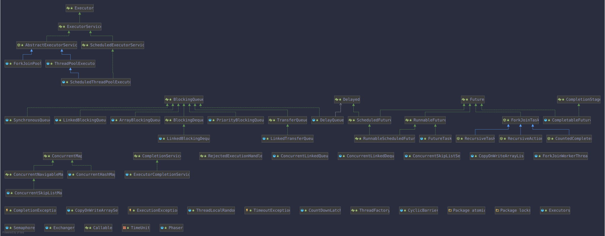
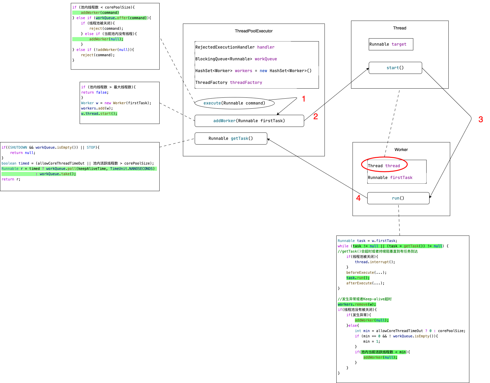
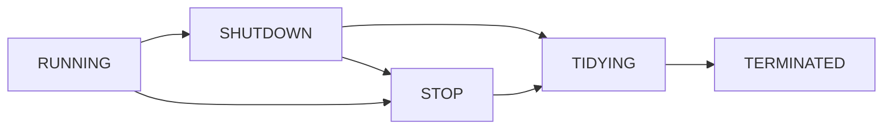
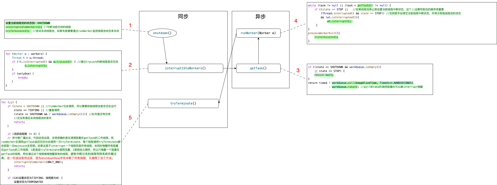
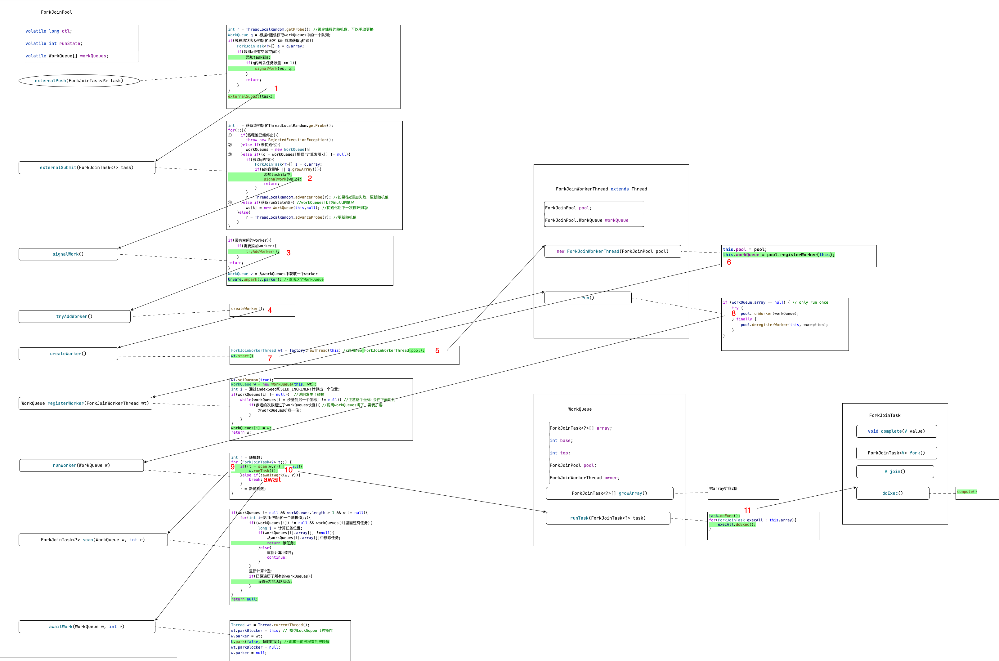
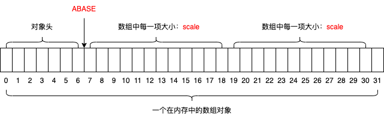

基于 jdk8 [https://docs.oracle.com/javase/8/docs/api/index.html](https://docs.oracle.com/javase/8/docs/api/index.html)

## 概览



## Executor

该接口只有一个方法 `execute(Runnable command)` 用于执行提交的 `Runnable` 任务。这个接口的目的是把任务的提交从任务的运行细节中进行解耦，使用者只需要提交任务到执行器，屏蔽了执行器使用线程、进行调度的具体细节。使用了执行器后不需要为每一个任务调用 `new Thread(new RunnableTask()).start()`。

注意，`Executor` 接口不严格限制实现类必须异步执行任务，执行器可以通过直接调用 `r.run()` 在调用线程中运行提交的任务。也就是说提交的任务有可能在一个新线程中执行，有可能在一个线程池中执行，也有可能在调用线程中执行。

JUC 包中提供的实现类同时也都实现了一个功能更丰富的接口 `ExecutorService` 。

`ThreadPoolExecutor` 是一个可扩展的线程池实现类。

`Executors` 工具类为创建不同种类的线程池实现类提供了方便的工厂方法。

提交任务遵循 [Happens-before](/posts/happens-before-order "Happens-before") 顺序

## ExecutorService

属于 Java 中的 Executor 框架。它提供了管理终止和跟踪异步任务进度的方法。ExecutorService 可以被关闭，这将导致它拒绝新的任务。提供了两种不同的方法来关闭ExecutorService 。shutdown 方法允许之前提交的任务在终止之前执行，而 shutdownNow 方法则防止等待任务启动并尝试停止当前正在执行的任务。在终止时，执行器没有任务正在执行，没有任务等待执行，也不能提交新的任务。未使用的 ExecutorService 应该被关闭以允许回收其资源。方法 submit 通过创建并返回可用于取消执行和/或等待完成的 Future 来扩展基本方法Executor.execute(Runnable)。方法 invokeAny 和 invokeAll 执行最常用的批量执行形式，执行一组任务，然后等待至少一个或全部完成。Executors 类提供了工厂方法，用于提供此包中提供的执行器服务。

## AbstractExecutorService

`AbstractExecutorService` 类提供了 `ExecutorService` 执行方法的默认实现。在默认实现的 `submit`、`invokeAny` 和 `invokeAll` 方法中，会把参数 `Runnable` 或 `Callable` 使用过 `newTaskFor` 方法包装成 `RunnableFuture` 对象来运行。

## ThreadPoolExecutor



`ExecutorService` 使用线程池来执行提交的任务，通常使用 `Executors` 工厂方法进行配置。线程池解决了两个不同的问题：当执行大量异步任务时，它们通常提供了更好的性能，因为减少了每个任务调用的开销；同时，它们提供了一种管理资源、线程的方式，以便在执行任务集合时限制和管理这些资源的消耗。每个 `ThreadPoolExecutor`还维护一些基本的统计信息，例如已完成的任务数。为了在广泛的上下文中有用，该类提供了许多可调参数和可扩展性钩子。

然而，更多情况下应该使用更方便的 `Executors` 工厂方法 `Executors.newCachedThreadPool`（无限制线程池，具有自动线程回收），`Executors.newFixedThreadPool`（固定大小线程池）和 `Executors.newSingleThreadExecutor`（单个后台线程），这些方法预配置了最常见的使用场景的设置。

否则，在手动配置和调整此类时，请注意以下问题：

### 线程池的最小和最大线程数量

`ThreadPoolExecutor`将根据 `corePoolSize`和 `maximumPoolSize`设置的边界自动调整池大小（参见 `getPoolSize`）。当在 `execute(Runnable)`方法中提交新任务，并且正在运行的线程少于 `corePoolSize`时，即使其他工作线程处于空闲状态，也将创建一个新线程来处理请求。如果正在运行的线程数大于 `corePoolSize`但小于 `maximumPoolSize`，则仅当队列已满时才会创建新线程。通过将 `corePoolSize`和 `maximumPoolSize`设置为相同的值，可以创建一个固定大小的线程池。通过将 `maximumPoolSize`设置为一个基本上无限制的值，例如 `Integer.MAX_VALUE`，可以允许池容纳任意数量的并发任务。通常，核心和最大池大小仅在构造时设置，但也可以使用 `setCorePoolSize`和 `setMaximumPoolSize`动态更改。

### 按需构建

默认情况下，即使是核心线程，也仅在有新任务到达时才会创建和启动，但是可以使用 `prestartCoreThread`或 `prestartAllCoreThreads`方法动态地覆盖此行为。如果使用非空的任务队列创建线程池，则可能需要预启动线程。

### 如何创建新线程

```java
    private volatile ThreadFactory threadFactory;

    private static final RuntimePermission shutdownPerm = new RuntimePermission("modifyThread");
```

使用 `ThreadFactory`创建新线程。如果没有另外指定，将使用 `Executors.defaultThreadFactory`，它创建的线程都在同一个 `ThreadGroup`中，并具有相同的 `NORM_PRIORITY`优先级和非守护进程状态。通过提供不同的 `ThreadFactory`，可以更改线程的名称、线程组、优先级、守护进程状态等。如果 `ThreadFactory` 在调用 `newThread` 创建线程时返回 `null` ，则执行程序将继续运行，但可能无法执行任何任务。线程池具有 “modifyThread” 的 `RuntimePermission`。"modifyThread" 权限它允许调用 `shutdown` 和 `shutdownNow`。通常，需要修改线程状态的代码（例如更改线程优先级或中断线程）需要此权限。要将此权限授予 Java 应用程序，您可以将以下行添加到应用程序的安全策略文件中，`grant java.lang.RuntimePermission "modifyThread";`这将允许应用程序在运行时修改线程。但是，授予此权限可能存在风险，因为它允许应用程序潜在地干扰 Java 虚拟机的正常操作。因此，它应该只授予需要它的可信代码。

`addWorker` 创建线程时有可能因为受到系统或用户控制创建失败。最常见的是 OutOfMemoryError ，因为需要给新的线程分配堆栈。

### Keep-alive

线程池中线程的保活时间。如果池当前有超过 `corePoolSize`个线程，那么如果它们空闲时间超过 `keepAliveTime`（参见 `getKeepAliveTime(TimeUnit)`），则多余的线程将被终止。这提供了一种在池没有活跃时减少资源消耗的方法。如果线程池池稍后变得更加活跃，将构造新线程。可以使用 `setKeepAliveTime(long, TimeUnit)`方法动态更改此参数。使用 `Long.MAX_VALUE TimeUnit.NANOSECONDS` 可以防止线程被回收。默认情况下，仅适用于池内线程个数超过 `corePoolSize` 个线程的情况。但是，`allowCoreThreadTimeOut(boolean)`方法可以用于将此超时策略应用于核心线程，只要 `keepAliveTime`值为非零即可。

### 任务队列

Java中的线程池中的任务队列可以使用任何实现了BlockingQueue接口的队列。线程池的使用与队列的选择有关：

1. 如果正在运行的线程数少于 `corePoolSize`，则执行器始终优先添加新线程而不是排队。
2. 如果正在运行的线程数等于或大于 `corePoolSize`，则执行器始终优先将请求排队而不是添加新线程。
3. 如果无法将请求排队，则创建一个新线程，除非这将超过 `maximumPoolSize`，否则将拒绝该任务。

有三种常见的队列策略：

1. 不排队。对于工作队列来说，SynchronousQueue 是一个很好的默认选择，它将任务直接交给线程而不会保留它们。在这里，如果没有立即可用的线程来运行任务，将构造一个新线程。这种策略避免了处理可能具有内部依赖关系的请求集时出现死锁。直接交接通常需要无限制的 `maximumPoolSizes`，以避免拒绝新提交的任务。命令的平均到达速度比它们可以被处理的速度更快时，可能导致线程无限增长。
2. 无界队列。使用无界队列（例如没有预定义容量的 LinkedBlockingQueue）将导致新任务在所有 `corePoolSize` 线程都忙时等待队列。因此，最多只会创建 `corePoolSize`个线程。（因此，`maximumPoolSize`的值没有作用。）当每个任务完全独立于其他任务时，这可能是适当的，因此任务不能影响彼此的执行。当命令的平均到达速度比它们可以被处理的速度更快时，会导致工作队列无限增长。
3. 有界队列。有界队列（例如ArrayBlockingQueue）有助于在使用有限 `maximumPoolSizes`时防止资源耗尽，但可能更难以调整和控制。队列大小和最大池大小可以相互交换：使用大队列和小池最小化CPU使用率、操作系统资源和上下文切换开销，但可能导致人为降低吞吐量。如果任务经常阻塞（例如，如果它们是I/O绑定的），则系统可能能够为更多线程安排时间，而不是您允许的线程数。使用小队列通常需要更大的池大小，这使CPU更忙碌，但可能会遇到不可接受的调度开销，这也会降低吞吐量。

方法 `getQueue()` 允许访问工作队列，以便进行监视和调试。强烈不建议将此方法用于任何其他目的。当大量排队的任务被取消时，提供了两个方法 `remove(Runnable)` 和 `purge` 来协助存储回收。在判断任务队列是否为空时，不能仅仅依赖于 `poll()` 方法返回 `null`，而应该使用 `isEmpty()` 方法来判断。这是因为有些特殊的队列，比如 `DelayQueue`，即使队列中有元素，`poll()` 方法也可能返回 `null`，只有等到延迟时间过后才会返回非空。因此，为了保证线程池的正常运行，需要使用 `isEmpty()` 方法来判断任务队列是否为空。

### 拒绝策略

```java
    private volatile RejectedExecutionHandler handler;

    private static final RejectedExecutionHandler defaultHandler = new AbortPolicy();
```

在方法 `execute(Runnable)` 中提交的新任务将在执行器已关闭时被拒绝，以及当执行器对最大线程数和工作队列容量都使用有限边界，并且已经饱和时也会被拒绝。在任一情况下，`execute`方法都会调用其RejectedExecutionHandler的 `RejectedExecutionHandler.rejectedExecution(Runnable, ThreadPoolExecutor)`方法。提供了四种预定义的处理程序策略：

1. 在默认的ThreadPoolExecutor.AbortPolicy中，处理程序在拒绝时抛出运行时RejectedExecutionException。
2. 在ThreadPoolExecutor.CallerRunsPolicy中，调用 `execute`的线程本身运行任务。这提供了一个简单的反馈控制机制，可以减缓提交新任务的速率。
3. 在ThreadPoolExecutor.DiscardPolicy中，无法执行的任务将被简单地丢弃。
4. 在ThreadPoolExecutor.DiscardOldestPolicy中，如果执行器没有关闭，则丢弃工作队列头部的任务，然后重试执行（这可能会再次失败，导致重复执行）。

可以定义和使用其他类型的RejectedExecutionHandler类。这样做需要一些小心，特别是当策略仅设计为在特定容量或排队策略下工作时。

### 钩子方法

这个类提供了受保护的可重写的 `beforeExecute(Thread, Runnable)` 和 `afterExecute(Runnable, Throwable)` 方法，它们在每个任务执行之前和之后被调用。这些方法可以用于操作执行环境；例如，重新初始化 ThreadLocals、收集统计信息或添加日志。此外，可以重写方法 `terminated` 来执行任何需要在执行器完全终止后完成的特殊处理。
如果钩子或回调方法抛出异常，内部工作线程可能会失败并突然终止。

### 析构

如果一个线程池在程序中不再被引用，并且没有剩余的线程，它将自动关闭。如果您希望确保即使用户忘记调用shutdown，未引用的线程池也会被回收，那么您必须通过设置适当的 Keep-alive Time、设置 0 个 `corePoolSize` 或设置 `allowCoreThreadTimeOut(boolean)` 来确保未使用的线程会被回收。

### 状态控制

```java
    private final AtomicInteger ctl = new AtomicInteger(ctlOf(RUNNING, 0));
    private static final int COUNT_BITS = Integer.SIZE - 3;
    private static final int CAPACITY   = (1 << COUNT_BITS) - 1;

    // runState is stored in the high-order bits
    private static final int RUNNING    = -1 << COUNT_BITS;
    private static final int SHUTDOWN   =  0 << COUNT_BITS;
    private static final int STOP       =  1 << COUNT_BITS;
    private static final int TIDYING    =  2 << COUNT_BITS;
    private static final int TERMINATED =  3 << COUNT_BITS;
```

主要的线程池控制状态ctl是一个原子整数，包含两个概念字段：`workerCount`，表示已启动但未停止的有效线程数；`runState`，表示是否正在运行、关闭等。为了将它们打包成一个 int ，我们将 `workerCount`限制为(2^29)-1（约5亿）个线程。如果不够用，变量可以更改为AtomicLong，并调整下面的移位/掩码常量。但在这之前，使用 int 的代码更快、更简单。`workerCount`是已被启动但未被停止的工作线程数。该值可能短暂地与实际活跃线程数不同，例如当ThreadFactory在被要求创建线程时失败，以及退出线程在终止之前仍在执行记录工作。用户可见的池大小为工作线程集的当前大小。`runState`提供了主要的生命周期控制，取值为：

1. RUNNING：接受新任务并处理排队的任务。
2. SHUTDOWN：不接受新任务，但处理排队的任务。
3. STOP：不接受新任务，不处理排队的任务，并中断正在进行的任务。
4. TIDYING：所有任务已终止，`workerCount` 为零，正在过渡到状态 TIDYING 的线程将运行 `terminated()` 钩子方法。
5. TERMINATED：`terminated()` 已完成。

这些值之间的数字大小很重要，以允许通过大小进行状态比较。`runState` 随时间单调递增，但不必经过所有的状态。存在如下状态转换：

1. RUNNING -> SHUTDOWN：调用 `shutdown()` 时，可能隐式地在 `finalize()` 中。
2. (RUNNING or SHUTDOWN) -> STOP：调用 `shutdownNow()` 时。
3. SHUTDOWN -> TIDYING：当队列和池都为空时。
4. STOP -> TIDYING：当池为空时。
5. TIDYING -> TERMINATED：当 `terminated()` 钩子方法完成时。



等待 `awaitTermination()` 的线程将在状态达到TERMINATED时返回。检测从SHUTDOWN到TIDYING的转换不像您希望的那样简单，因为在SHUTDOWN状态下，队列可能从非空变成空，也可能从空变成非空，但我们只有在看到它为空后，看到 `workerCount` 为0时才能终止（有时需要重新检查--见下文）。

### 锁

线程池当中用到了两个锁，一个是全局可重入锁，另一个是Worker对象继承的AQS：

```java
private final ReentrantLock mainLock = new ReentrantLock();

private final class Worker
        extends AbstractQueuedSynchronizer
        implements Runnable{
...
}
```

关于这两个锁的详细介绍，注释里描述的可能比较抽象，可以参考这边文章辅助理解：[https://www.cnblogs.com/thisiswhy/p/15493027.html](https://www.cnblogs.com/thisiswhy/p/15493027.html)

大致意思上，全局锁用于控制 `addWorker` 锁同步，和线程池的 `largestPoolSize` 统计数据同步，以及 `interruptIdleWorkers` 的方法调用同步。

而Worker 对象的锁：自定义 worker 类的大前提是为了维护中断状态，因为正在执行任务的线程是不应该被中断的。而不能用重入锁，重入锁会在调用 `interruptIdleWorkers` 时中断进行中的线程。

### Worker 类

Worker类主要维护线程运行任务的中断控制状态，以及其他一些次要的记录。这个类通过继承 AbstractQueuedSynchronizer 类来简化每个任务执行时获取和释放锁的过程，以保护正在运行的任务不被中断。实现了一个简单的非可重入互斥锁，而不是使用 ReentrantLock，因为不希望工作线程在调用 `setCorePoolSize` 等池控制方法时能够重新获取锁。此外，为了在线程实际开始运行任务之前防止中断，我们将锁状态初始化为负值，并在启动时（在runWorker中）清除它。

### 关闭线程池



调用 `shutdown()` 会启动一个有序的关闭过程，在此过程中，之前提交的任务会被执行，但不会接受新的任务。如果已经关闭，则调用此方法不会产生额外的影响。此方法不会同步等待所有线程停止执行。如果需要等待，请使用 `awaitTermination()` 方法。

`shutdownNow()` 方法尝试停止所有正在执行的线程，停止处理等待中的任务，并把返回 `workQueue` 中的任务。这些任务在方法返回时会从 `workQueue` 中被清除。此方法不会同步等待所有线程停止执行。如果需要等待，请使用 `awaitTermination()` 方法。无法保证能够完全停止正在执行的任务，只能尽力尝试。此实现通过 `Thread.interrupt()` 方法来取消任务，因此任何无法响应中断的任务可能永远无法终止。

## ScheduledThreadPoolExecutor

### ScheduledFutureTask

继承自 `FutureTask<V>` 并实现了 `RunnableScheduledFuture<V>` 接口。`ScheduledFutureTask` 类表示一个可以在给定的延迟时间后执行的任务，它可以是一次性任务或周期性任务。

#### 关键属性

* `sequenceNumber`：用于在任务优先级相同时，按照任务提交的顺序执行。
* `time`：任务启动执行的时间（以纳秒为单位）。
* `period`：对于周期性任务，表示两次执行之间的时间间隔（以纳秒为单位）。正值表示固定速率执行，负值表示固定延迟执行，0 表示非重复任务。
* `outerTask`：实际要重新入队的周期性任务。
* `heapIndex`：任务在延迟队列中的索引，用于支持快速取消。

#### 真正执行任务的 `run()` 方法

1. 首先判断任务是否可以在当前运行状态下执行，如果不能执行，则取消任务。
2. 对于非周期性任务，直接调用 FutureTask 的 `run()` 方法执行任务。
3. 对于周期性任务，调用 FutureTask 的 `runAndReset()` 方法执行任务并重置任务状态。如果任务执行成功，则设置下一次执行时间，并将任务重新加入到执行队列中。

### DelayedWorkQueue

延迟工作队列的实现，它继承了 `AbstractQueue<Runnable>`并实现了 `BlockingQueue<Runnable>`接口。使用基于堆的数据结构。每个 `ScheduledFutureTask` 还记录其在堆数组中的索引，可以在取消任务时不必循环到数组中查找。加快了删除速度（从O（n）降至O（log n））。但是，由于队列还可能持有不是 `ScheduledFutureTasks` 类型的 `RunnableScheduledFutures` 实现类，因此不能保证这些索引可用，在这种情况下，会退回到线性搜索。同一个 `ScheduledFutureTasks` 在队列中最多只能有一个。

#### 扩容

堆数组的初始容量为16，在添加任务时判断如果任务数 >= 任务队列长度，就调用 `grow()` 方法一次扩容1/2。

#### 任务队列

基于最小堆的数据结构实现，按照任务距离下一次执行的 delay 时间排序。数组的第0位永远是执行时间最早的，也就是接下来要执行的那个任务。通过 `siftUp()` 和 `siftDown()` 两个方法维护结构的正确性。

#### 线程模型

`ScheduledThreadPoolExecutor` 使用了一种基于Leader-Follower模式的线程等待队列的实现方式，同一时间只有一个 leader 线程在限时等待任务队列中的第一个任务，其他线程不限时等待唤醒。当第一个任务到执行时间时，leader 线程唤醒一个新的 leader 线程，然后自己去处理到时的任务。

1. 所有不需要超时结束的线程默认都在 `getTask()` 的 `queue.take()` 方法中的无限for循环中，通过 `available.await()` 不限时等待。
2. 添加任务时，会调用 `available.signal()` 随机唤醒一个线程。
3. 如果任务队列的第一个任务 `queue[0]` 有任务，计算这个任务接下来的 delay 时间，当前线程作为 leader 通过调用限时等待 `available.awaitNanos(delay)` 等待任务到时后自动唤醒。
4. 如果计算的 delay 时间 <= 0，说明该任务到达执行时间，则当前 leader 线程唤醒一个新线程当 leader，自己去处理到时的任务。
5. 需要超时结束的线程会在 `getTask()` 的 `queue.poll()` 方法中通过 `available.awaitNanos(delay)` 进行超时等待。

### 关闭线程池

可以通过设置 `continueExistingPeriodicTasksAfterShutdown` 允许在线程池关闭后继续执行未完成的周期性任务。通过设置 `executeExistingDelayedTasksAfterShutdown` 允许在线程池关闭后继续执行未完成的延时任务。

## ForkJoinPool

[https://juejin.cn/post/6932632481526972430](https://juejin.cn/post/6932632481526972430)



### ForkJoinTask.join()

任务窃取的关键方法入口。

### ABASE/ASHIFT

在JDK中 ConcurrentHashMap 和 ForkJoinPool 都有使用 Unsafe 类来操作数组的行为。这种方式对性能的提升基于使用场景暂且不考虑，但是这种使用方式需要理解其生效原理。这种代码有一种固定的格式：

```java
Class<?> ak = ForkJoinTask[].class;
int ABASE = U.arrayBaseOffset(ak);		//1️⃣
int scale = U.arrayIndexScale(ak);	//2️⃣
if ((scale & (scale - 1)) != 0)
    throw new Error("data type scale not a power of two");	//3️⃣
int ASHIFT = 31 - Integer.numberOfLeadingZeros(scale);
ForkJoinTask[] array = [...];
ForkJoinTask item = U.getObjectVolatile(array, (index << ASHIFT) + ABASE);	//4️⃣
```



1️⃣：通过 Unsafe 类获取数组对象中的元素起始地址

2️⃣：通过 Unsafe 类获取数组中每个元素占用内存空间

到这里如果需要获取数组中某一个位置 index 的元素，就可以通过调用 `U.getObjectVolatile(array,  ABASE + (index ✖️ scale))` 来获得。

3️⃣：`(scale & (scale - 1)) != 0` 目的是判断 scale 的第 0 位是否是 0，借此判断奇偶。因为在 Java 中数组元素是基本数据类型或者对象地址，所以这里就确定了所有数组元素的大小都能是 2 的幂值。

4️⃣：31 减去 scale 高位 0 的数量，也就是计算 scale 低位有多少个 0，也就是计算 scale 是 2 的多少次幂。及 $2^{ASHIFT}=scale$，也就是 $2\times2\times...(ASHIFT个2)$。那么 $index \times scale = index \times 2^{ASHIFT} = index << ASHIFT $。所以 `U.getObjectVolatile(array,  ABASE + (index ✖️ scale))` 就等同于 `U.getObjectVolatile(array,  ABASE + (index << ASHIFT))`。

### SQMASK

值为0x007e，0b0111 1110。用于外部提交任务的没有线程的工作队列最多占 64 个偶数坐标位置。

### WorkQueue.qlock

用于表示 WorkQueue 的锁状态。`qlock` 的值有以下几种情况：

1. `qlock = 0`：表示工作队列未被锁定，可以正常工作。
2. `qlock = 1`：表示工作队列被锁定，其他线程不能对其进行修改。这通常发生在工作队列需要通过 `U.compareAndSwapInt()` 进行一些原子操作时，例如扩容、收缩等。
3. `qlock < 0`：表示工作队列正在终止或已经终止。在这种情况下，工作线程应该停止处理该工作队列，并可能需要执行一些清理操作。

### SCANNING

值为1，用于与 `WorkQueue.scanState` 的第0位进行位操作。为 0 时表示这个 WorkQueue 在运行任务。

在 tryCompensate 方法中用于检查线程池中的运行中的 WorkQueue 数量。

```java
for (int i = 0; i <= m; ++i) {
	WorkQueue v;
 	if ((v = ws[((i << 1) | 1) & m]) != null) {
		if ((v.scanState & SCANNING) != 0){
			break;
		}
		++nbusy;
	}
}
if (nbusy != (tc << 1) || ctl != c){
	canBlock = false;                 // 不能阻塞当前线程
}
```

这段代码的条件判断包含两部分：

1. `nbusy != (tc << 1)`：`nbusy` 是当前正在工作的线程数，`tc` 是线程池中的总线程数。这个条件判断检查当前正在工作的线程数是否等于总线程数的2倍。
2. `ctl != c`：`ctl` 是线程池的控制状态，`c` 是之前记录的线程池控制状态。这个条件判断检查线程池的控制状态是否发生了变化。如果发生了变化，说明线程池的状态可能不稳定，不能阻塞。

如果这两个条件中的任何一个满足，那么线程池的状态可能不稳定，不能阻塞。

### 队列 Mode

```java
public ForkJoinPool(boolean asyncMode,...){
	this(asyncMode ? FIFO_QUEUE : LIFO_QUEUE);
...
}

// Mode bits for ForkJoinPool.config and WorkQueue.config
static final int MODE_MASK    = 0xffff << 16;  // top half of int
static final int LIFO_QUEUE   = 0;
static final int FIFO_QUEUE   = 1 << 16;
static final int SHARED_QUEUE = 1 << 31;       // must be negative
```

WorkQueue 中的任务队列是堆栈数据结构。窃取任务是从其他队列的 base 端也就是栈低获取任务。执行完任务后会把拆分后的放到自己任务队列的 top 端也就是栈顶。

由此可见栈低以未被拆分的大任务为主。拆分后栈顶以小任务为主。

一个 WorkQueue 在执行完一个任务后会调用 excelLocalTasks() 来继续执行自己任务队列中的任务。这时的任务执行顺序有两种。

一种是 FIFO 从栈低开始执行，这种是广度优先，会尽量的先把所有任务都拆分，最后执行最小的任务。因为任务窃取也是从栈低窃取，所以会产生锁竞争。

另一种是 LIFO 从栈顶开始执行，这种是深度优先，会尽量把一个任务一直拆到最细并执行。

构造函数中可以通过 `asyncMode` 来指定工作模式：

1. `asyncMode = true`：表示线程池中的工作线程采用 **异步模式** （Asynchronous Mode）处理分叉任务。在异步模式下，工作线程使用先进先出（FIFO）的调度策略处理从未被 join 的分叉任务。这种模式可能更适合于那些工作线程只处理事件驱动型异步任务的应用场景。
2. `asyncMode = false`：表示线程池中的工作线程采用 **同步模式** （Synchronous Mode）处理分叉任务。在同步模式下，工作线程使用后进先出（LIFO）的调度策略处理分叉任务。这是 `ForkJoinPool` 的默认调度模式，适用于大多数场景，尤其是那些涉及到任务分解和合并的计算密集型任务。

通过设置 `asyncMode` 参数，可以根据实际应用场景选择合适的调度模式，以提高线程池中工作线程处理任务的效率。

### workQueues 初始化

```java
// `SMASK` 掩码 `config` 中的低 16 位表示 ForkJoinPool 的并行度。
static final int SMASK        = 0xffff;   
static final int MAX_CAP      = 0x7fff;        // max #workers - 1

ForkJoinPool(int parallelism,int mode){
    if (parallelism <= 0 || parallelism > MAX_CAP){
            throw new IllegalArgumentException();
	}
    //使用构造方法中的并行度参数 parallelism 来初始化 config
    this.config = (parallelism & SMASK) | mode;   
    long np = (long)(-parallelism); // offset ctl counts
    this.ctl = ((np << AC_SHIFT) & AC_MASK) | ((np << TC_SHIFT) & TC_MASK);
}

// create workQueues array with size a power of two
// 取出初始化的 parallelism
int p = config & SMASK;   
//计算大于等于初始并行度的 2 次幂，p - 1 是为了兼容等于的情况；p > 1 的判断是为了确保至少有 2 并行度，之所以判断大于 1 也是为了兼容后面的判断中等于的情况。  
int n = (p > 1) ? p - 1 : 1;  
//下面两行计算大于 n 的 2 次幂减 1，填充最高位 1 右边的所有位为 1。
n |= n >>> 1; n |= n >>> 2;  n |= n >>> 4;
n |= n >>> 8; n |= n >>> 16; 
//n + 1 得到大于等于初始化parallelism 的2次幂；左移 1 位是因为 workQueues 中有一半是存储外部线程提交的任务，不启动 Thread。
n = (n + 1) << 1;
//最终结果限制 ForkJoinPool 中最多有 Ox8000 个带线程的 WorkQueue；Ox8000 个不带线程的 WorkQueue。总共有 0x10000 个 WorkQueue
workQueues = new WorkQueue[n];
```

ForkJoinPool 初始化后只有一些配置，内部队列还都是空的。当调用提交任务时，会创建不带线程的偶数位置的 WorkQueue 并提交任务。提交成功后会创建其他带线程的 WorkQueue 来窃取并执行任务。当此 `workQueues` 初始化完毕。

### ForkJoinPool 状态控制

```java
volatile int runState;               // 可以加锁的状态
// runState bits: SHUTDOWN 状态一定是负数；
private static final int  RSLOCK     = 1;   //状态锁
/*RSIGNAL 是一个表示 ForkJoinPool 中 runState 的信号位，其值为 2。它的作用是在等待状态锁时，表示需要通知其他线程唤醒正在等待的线程。
在 awaitRunStateLock() 方法中，当一个线程尝试获取运行状态锁失败并且自旋等待也无法获取时，它会将 runState 的 RSIGNAL 位置为 1，表示需要唤醒等待的线程。然后，这个线程会进入阻塞状态，等待其他线程释放运行状态锁并发出通知。
当其他线程释放运行状态锁时，它会检查 runState 的 RSIGNAL 位是否为 1。如果为 1，表示有等待的线程需要唤醒，它会调用 notifyAll() 方法来唤醒所有正在等待的线程。
总之，RSIGNAL 的作用是在等待运行状态锁的过程中，作为一个信号来通知其他线程唤醒正在等待的线程。*/
private static final int  RSIGNAL    = 1 << 1;
private static final int  STARTED    = 1 << 2;  //已启动
private static final int  STOP       = 1 << 29; //停止
private static final int  TERMINATED = 1 << 30; //已终止
private static final int  SHUTDOWN   = 1 << 31; //已关闭

```

ForkJoinPool 中的状态流转主要由 `runState` 变量控制。`runState` 是一个整型变量，用于表示 ForkJoinPool 的运行状态。它的每一位都有特定的含义，以下是一些关键的状态位：

1. `RSLOCK`（值为 1）：表示 runState 锁的状态。
2. `STARTED`（值为 1 << 2）：表示 ForkJoinPool 已启动。
3. `STOP`（值为 1 << 29）：表示 ForkJoinPool 停止。
4. `TERMINATED`（值为 1 << 30）：表示 ForkJoinPool 已终止。
5. `SHUTDOWN`（值为 1 << 31）：表示 ForkJoinPool 已关闭。

ForkJoinPool 的状态流转如下：

1. **初始状态**：当 ForkJoinPool 实例被创建时，`runState` 的值为 0，表示初始状态。
2. **启动状态**：当第一个任务提交到 ForkJoinPool 时，`runState` 的值会变为 `STARTED`，表示已启动。
3. **关闭状态**：当调用 `shutdown()` 方法时，`runState` 的值会变为 `SHUTDOWN`，表示已关闭。在此状态下，ForkJoinPool 不再接受新任务，但仍会执行已提交的任务。
4. **停止状态**：当调用 `shutdownNow()` 方法或者发生异常时，`runState` 的值会变为 `STOP`，表示停止。在此状态下，ForkJoinPool 不再接受新任务，同时会尝试取消所有正在执行的任务。
5. **终止状态**：当所有任务都已完成执行且所有工作线程都已终止时，`runState` 的值会变为 `TERMINATED`，表示已终止。在此状态下，ForkJoinPool 完全不再工作。

在整个状态流转过程中，状态会从初始状态逐步向终止状态过渡，不会回退到之前的状态。

### 任务分配和任务窃取

1、ForkJoinPool 对外提供任务提交接口有：

* `invoke` 提交一个任务，同步等待返回结果。
* `invokeAll` 提交一组任务，同步等待所有任务完成。
* `execute` 提交一个无返回结果的任务。
* `submit` 提交一个任务，并返回任务对象，调用者可以在需要的时候 `join` 或 `get` 等待结果。

外部提交的任务会根据 `ThreadLocalRandom.getProbe()` 随机放到最多 64 个（个数受并行度限制）偶数位置 WorkQueue 的任务队列 `top` 位置。

2、WorkQueue 线程在没有任务时，会优先从 `hit` 或者 1 位置开始遍历 workQueues ，从有任务的 WorkQueue 任务队列的 `base` 位置获取任务。

3、运行任务，然后调用 `execLocalTasks()` 运行所有自己任务队列中的任务。如果配置了 `FIFO` ，就从 `top` 位置开始运行任务。否则从 `base` 位置开始。

4、ForkJoinTask 提供的任务控制接口有：

* `fork` 会提交任务到池中异步执行。如果在外部调用，会提交到 `common` 池中。
* `join` 如果外部调用会同步执行并等待返回结果；如果已经调过 fork 会先去池中获取任务结果，如果任务还没有被执行就同步执行。
* `invoke` 会同步执行并返回结果。
* `involeAll` 会先把**其他的任务**都 `fork` 提交到池中，然后调用 `doInvoke` 同步执行第一个任务。如果任务有返回结果，可以搭配 `get` 获取返回结果。
* `get` 由 Feature 接口继承而来，会同步执行并等待返回结果，可以配置超时时间。会抛出检查异常 `InterruptedException` 或 `ExecutionException` 强制使用者捕获。

## CountDownLatch

使用 AQS 实现计数和等待的功能，有一个内部类 Sync  继承了 AbstractQueuedSynchronizer ，来实现计数状态的增加减少。

```java
    private static final class Sync extends AbstractQueuedSynchronizer {

        Sync(int count) {
            setState(count);
        }

        int getCount() {
            return getState();
        }

        protected int tryAcquireShared(int acquires) {
            return (getState() == 0) ? 1 : -1;
        }

        protected boolean tryReleaseShared(int releases) {
            // Decrement count; signal when transition to zero
            for (;;) {
                int c = getState();
                if (c == 0)
                    return false;
                int nextc = c-1;
                if (compareAndSetState(c, nextc))
                    return nextc == 0;
            }
        }
    }
```

## CyclicBarrier

内部有一个 `count` 字段用于保存计数。使用 ReentrantLock 和 Condition 来实现现成等待。内部类 Generation 保存等待的线程中是否发生了异常。

## CyclicBarrier 和 CountDownLatch

CountDownLatch和CyclicBarrier都是java.util.concurrent包提供的同步辅助类，在多线程编程中用来协调线程之间的同步。它们虽然在某些用途上看似相似，但实际上用途和工作方式有所不同。

#### CountDownLatch

1. **基本概念**：CountDownLatch是一个同步计数器，构造时传入int参数，表示需要等待的事件数量。每当一个事件完成，计数器的值就会减一。当计数器值减到0时，所有等待的线程就会被释放。
2. **主要方法**：

   - `countDown()`：计数器减1。
   - `await()`：调用该方法的线程会被阻塞，直到计数器值为0。
3. **使用场景**：当你需要等待某些操作完成才继续执行，如并发控制初始化操作。
4. **特点**：CountDownLatch是一次性的，计数器减到0后就不能再使用了。

#### CyclicBarrier

1. **基本概念**：CyclicBarrier是一个同步辅助类，允许一组线程相互等待，直到所有线程都到达一个公共屏障点（Barrier）。
2. **主要方法**：

   - `await()`：到达屏障点，并等待其他线程。
   - `getParties()`：获取要在屏障处同步的线程数。
   - `reset()`：重置屏障。
3. **使用场景**：适用于多个线程相互等待至某个状态，然后这一批线程再同时执行。
4. **特点**：CyclicBarrier可以重复使用，当所有等待线程都被释放后，可以重置计数器。

#### 比较

1. **用途不同**：

   - CountDownLatch主要用于一个线程等待多个线程的某些操作完成。
   - CyclicBarrier则是用于多个线程间相互等待，直到所有线程都准备就绪。
2. **可重用性**：

   - CountDownLatch不能重置，一旦计数器减到0就不能再用了。
   - CyclicBarrier可以重置，因此可以支持更为复杂的场景，如重复的并发任务。
3. **方法差异**：

   - CountDownLatch主要是通过 `countDown()`来减计数器，通过 `await()`来等待计数器归零。
   - CyclicBarrier主要通过 `await()`来等待其他线程，所有线程必须都达到屏障点才能继续执行。
4. **设计目的**：

   - CountDownLatch设计用来等待其他线程完成，以便在这些线程的操作全部完成后才执行某个动作。
   - CyclicBarrier设计用来实现多个线程间的互相等待，直至所有线程都准备就绪后再一起继续执行后续的操作。

在实际应用中，选择哪个类取决于你的具体需求。如果是一组操作一起等待至某个状态，然后再一起执行，那么CyclicBarrier是合适的；如果是主线程需要等待一组操作全部完成后才能继续执行，那么CountDownLatch是更合适的选择。

## Semaphore

信号量（Semaphore）是一种用于控制多线程访问共享资源的同步机制。它维护一组许可证，每个 `acquire`操作会阻塞直到获得许可证，每个 `release`操作则会增加一个许可证。

信号量常用于限制可以访问某些资源的线程数。例如，可以使用信号量来控制对资源池的访问。在获取资源之前，每个线程必须从信号量获取许可，以确保资源可用。当线程使用完资源后，它将资源返回到池中，并将许可证返回给信号量，允许其他线程获取资源。

初始化为1的信号量可以用作互斥锁，这通常被称为二进制信号量，因为它只有两种状态：一个可用的许可证，或零个可用的许可证。当以这种方式使用时，二进制信号量具有属性，即“锁”可以由所有者以外的线程释放。

此类的构造函数可以选择接受公平性参数。如果设置为false，此类不保证线程获取许可的顺序。当公平性设置为true时，信号量保证按照处理调用 `acquire`方法的顺序（先进先出；FIFO）来选择线程。

通常，用于控制资源访问的信号量应初始化为公平，以确保没有线程因访问资源而饥饿。当使用信号量进行其他类型的同步控制时，非公平排序的吞吐量优势通常超过公平性考虑因素。

此类还提供了一次获取或释放多个许可证的方法。在没有公平性的情况下使用这些方法时，需要注意无限期推迟的风险增加。

## Phaser

### 同步多阶段任务

- **多阶段同步**:
  - Phaser类用于在执行多阶段任务时同步一个或多个线程，确保在进入下一个阶段之前所有线程完成当前阶段。

#### 示例：

```java
import java.util.concurrent.Phaser;

public class PhaserExample {
    public static void main(String[] args) {
        Phaser phaser = new Phaser(1); // 主线程注册
        int currentPhase;

        System.out.println("Starting");

        new Worker(phaser, "A").start();
        new Worker(phaser, "B").start();
        new Worker(phaser, "C").start();

        // 等待所有任务完成第一阶段
        currentPhase = phaser.getPhase();
        phaser.arriveAndAwaitAdvance();
        System.out.println("Phase " + currentPhase + " completed");

        // 等待所有任务完成第二阶段
        currentPhase = phaser.getPhase();
        phaser.arriveAndAwaitAdvance();
        System.out.println("Phase " + currentPhase + " completed");

        // 解除注册，表示所有阶段均已完成
        phaser.arriveAndDeregister();
        if(phaser.isTerminated()) {
            System.out.println("Phaser is terminated");
        }
    }

    static class Worker extends Thread {
        private final Phaser phaser;

        Worker(Phaser phaser, String name) {
            this.phaser = phaser;
            this.setName(name);
            phaser.register(); // 线程注册
        }

        public void run() {
            System.out.println(this.getName() + " starting phase 1");
            phaser.arriveAndAwaitAdvance(); // 等待其他线程完成阶段1

            // 暂停一会儿，用于模拟不同的工作负载
            try {
                Thread.sleep(100);
            } catch (InterruptedException e) {
                System.out.println(e.toString());
            }

            System.out.println(this.getName() + " starting phase 2");
            phaser.arriveAndAwaitAdvance(); // 等待其他线程完成阶段2

            // 解除注册
            phaser.arriveAndDeregister();
        }
    }
}
```

在这个示例中，我们创建了一个Phaser实例，并注册了主线程。然后创建了三个Worker线程，每个线程在启动时向Phaser注册。每个Worker在完成它们的第一阶段和第二阶段工作后会等待其他线程。主线程等待每个阶段的完成，然后在所有阶段结束后注销Phaser。

### 动态线程管理

- **参与者动态注册**:
  - Phaser允许线程在执行过程中动态地注册和注销，这在不确定参与者数量时非常有用。

#### 示例：

```java
// 在Worker类中的构造函数中使用phaser.register()来动态注册线程
```

### 支持不同的同步模式

- **屏障和重复任务**:
  - Phaser可以用作 `CyclicBarrier`和 `CountDownLatch`的替代品，并且可以重复使用。

#### 示例：

```java
// 在上文的Worker类中，phaser.arriveAndAwaitAdvance()的使用类似于CyclicBarrier的await()方法。
```

### 高级功能

- **可定制的行为**:
  - 通过覆写 `onAdvance()`方法，可以定制每个阶段变化时的行为。

#### 示例：

```java
class CustomPhaser extends Phaser {
    @Override
    protected boolean onAdvance(int phase, int registeredParties) {
        System.out.println("Phase " + phase + " completed with " + registeredParties + " parties registered");
        // 返回true将终止phaser，返回false将继续
        return phase >= 1 || registeredParties == 0; // 假设我们只有两个阶段
    }
}
```

### 结论

Phaser是一个强大的同步工具，它能够处理多阶段任务的同步问题，并支持动态的线程注册和注销，同时提供了可定制的同步行为。以上示例展示了如何使用Phaser来同步线程执行多阶段任务，并介绍了如何通过继承Phaser类并覆写 `onAdvance()`方法来定制行为。Phaser的灵活性使它成为并发编程中不可或缺的工具之一。

## ConcurrentHashMap

[https://www.cnblogs.com/tyux/articles/15885226.html](https://www.cnblogs.com/tyux/articles/15885226.html)

### 概述

在JDK 1.7及之前的版本中，ConcurrentHashMap的实现基于“分段锁”技术。整个Map被分为一定数量的段(Segment)，put和get操作都是针对于某一个具体的段进行的，这样能够实现真正的并发性。

1. **Segment分段锁**：ConcurrentHashMap内部使用一个Segment数组。Segment是一种可重入的锁ReentrantLock，在ConcurrentHashMap扮演锁的角色，Segment继承自ReentrantLock并且拥有一个HashEntry数组，它的结构如下：

```java
static final class Segment<K,V> extends ReentrantLock implements Serializable {
    private static final long serialVersionUID = 2249069246763182397L;
    transient volatile HashEntry<K,V>[] table;
    transient int count;
    transient int modCount;
    transient int threshold;
    final float loadFactor;
}
```

2. **HashEntry**：这是ConcurrentHashMap的基本存储单位。每个HashEntry都包含一个key-value对，以及指向下一个HashEntry的引用，形成链表结构。

```java
static final class HashEntry<K,V> {
    final K key;
    final int hash;
    volatile V value;
    final HashEntry<K,V> next;
}
```

3. **并发性**：ConcurrentHashMap的并发性能得到了大幅提升，因为全局只需要锁定一部分Segment，而不需要像HashTable那样锁定整个数据结构。不同的线程可以同时操作不同的Segment，从而提高整体的并发性能。
4. **扩容**：当某个Segment中的元素数量达到阈值时，就会触发扩容，扩容只会影响到该Segment，不会影响到其他的Segment。
5. **安全性**：虽然ConcurrentHashMap通过对Segment的修改加锁允许多个修改操作并发进行，这种机制可以确保并发修改操作的安全性。

总的来说，JDK 1.7及之前的ConcurrentHashMap通过“分段锁”技术实现了高并发性能，同时保证了线程安全。

在JDK 1.8及之后的版本中，ConcurrentHashMap的实现进行了重构，放弃了Segment的概念，而是引入了红黑树。同时，JDK 1.8的实现使用了一种更加复杂的无锁算法（CAS操作）。以下是详细的介绍：

1. **Node节点**：在JDK 1.8中，ConcurrentHashMap的基本存储单位变为了Node节点，每个Node都包含一个key-value对，以及指向下一个Node的引用，形成链表结构。

```java
static class Node<K,V> implements Map.Entry<K,V> {
    final int hash;
    final K key;
    volatile V val;
    volatile Node<K,V> next;
}
```

2. **并发性**：在JDK 1.8中，ConcurrentHashMap的并发性能得到了进一步的提升。在进行插入、删除和更新操作时，不再是对整个Segment加锁，而是采用CAS操作，只对具体的Node进行同步。这样，即使多个线程操作同一个Segment，只要不是操作同一个Node，也能够并发进行。
3. **红黑树**：当链表长度大于一定阈值（默认为8）时，链表就转换为高度更低的红黑树。这样可以在链表长度较大时，提高查找效率。
4. **扩容**：在JDK 1.8中，ConcurrentHashMap的扩容机制也进行了优化。当某个Node数组需要扩容时，不再创建一个新的Node数组然后将旧的Node复制过去，而是采用了一种新的扩容方式，可以在不影响查询操作的前提下进行扩容。
5. **计数**：在JDK 1.8中，ConcurrentHashMap的计数方式也进行了优化。在JDK 1.7中，每个Segment维护一个元素计数器，获取size时需要把所有Segment的计数器加起来。而在JDK 1.8中，引入了一个新的计数方式，可以更快地获取到准确的元素数量。

总的来说，JDK 1.8的ConcurrentHashMap在保证线程安全的同时，通过引入红黑树、优化扩容机制和计数方式，进一步提高了其性能。

### 初始化

构造函数只会设置一些参数，只有在第一次插入数据时才会进行初始化操作。构造函数中可以设置初始容量、加载因子、并发级别。

* initialCapacity：初始容量，即 ConcurrentHashMap 内部用于存储元素的数组的初始大小。如果知道将要存储的元素数量，可以适当调大这个值，避免频繁的扩容操作。
* loadFactor：加载因子，当 ConcurrentHashMap 中的元素数量超过数组大小与加载因子的乘积时，就会进行扩容操作。加载因子的默认值是 0.75。
* concurrencyLevel：并发级别，表示预期的并发更新线程数。在实际操作中，并不直接影响并发级别，只是用来在初始化时帮助调整内部数组的大小。在 JDK 1.8 中，这个参数已经不再重要，因为 ConcurrentHashMap 会根据需要自动进行扩容。

使用 sizeCtl 控制初始化过程：

1. 如果sizeCtl小于0，说明已经有其他线程在进行初始化或者扩容操作，当前线程就让出CPU，等待其他线程完成操作。
2. 如果sizeCtl大于等于0，就尝试使用CAS操作将sizeCtl设置为-1，表示当前线程将进行初始化或者扩容操作。
3. 初始化或者扩容Node数组，如果sizeCtl大于0，就使用sizeCtl作为新数组的长度，否则使用默认的初始容量（DEFAULT_CAPACITY）。
4. 设置sizeCtl为新数组长度的0.75倍，这是为了在数组元素达到这个数量时就开始扩容，保证ConcurrentHashMap的查询效率。

### hash散列值

ConcurrentHashMap 中节点的 hash 值有多种含义。普通的 hash 值是用过 `spread(key.hashCode())` 计算获得。spread 方法主要作用是保证hash值的分布更均匀，以减少hash碰撞。spread方法的实现非常简单，它只有一行代码：`(h ^ (h >>> 16)) & HASH_BITS`。`& HASH_BITS`是与操作，HASH_BITS是一个常量，值为0x7fffffff，用来保证结果为正数。

将哈希的高位传播（异或）到低位。因为掩码是 2 的次幂，所以当哈希值只在高位变化时，总会发生碰撞。（已知的例子中包括在小表中持有连续整数的Float键的集合）所以使用这种方式将高位的影响向下扩散。在速度、效用和位扩散质量之间有一个权衡。因为许多常见的哈希集已经合理分布（所以不会从扩散中受益），并且因为我们使用树来处理 bin 中的大量碰撞，我们只是以成本最低的方式异或一些位，以减少系统性的损失。

同时存在以下几种特殊的hash值：

1. MOVED(-1)：表示当前节点正在进行扩容操作，节点的数据已经被转移到新的数组中。当其他线程在进行put、get等操作时，如果发现某个节点的hash值为MOVED，那么这个线程会帮助进行数据的迁移。
2. TREEBIN(-2)：表示当前节点已经转化为红黑树结构。当链表的长度超过一定阈值（默认为8）时，链表会转化为红黑树，提高查询效率。
3. RESERVED(-3)：表示当前节点已经被其他线程预定，即其他线程正在进行put或者remove操作。当其他线程在进行查询操作时，如果发现某个节点的hash值为RESERVED，那么这个线程会等待，直到RESERVED状态结束。

这三种特殊的 hash 值主要是为了在高并发环境下，保证 ConcurrentHashMap 的线程安全性和高效性。

### 扩容

在以下场景会触发扩容：

1. putVal 后容量超过扩容阈值
2. 调用 putAll 时提前申请空间
3. treeifyBin 时如果 tab.lengtb (数组长度，桶数量)小于转换成红黑树最小阈值 `MIN_TREEIFY_CAPACITY = 64` ，会扩容一倍。

### 数据迁移

在触发扩容时线程会发起初始数据迁移。在 putVal 时如果头节点的 `hash == MOVED == -1` ，线程会帮助进行数据迁移。数据迁移可多线程并行进行。

迁移从数组结尾开始，向数组第一位方向进行。每个进行迁移的线程会划分一段自己要迁移的区域，把下一次迁移开始的数组下标存到 transferIndex 中，然后开始迁移数据。其他进行数据迁移的线程会从 transferIndex 开始继续向数组头方向进行。一次数据迁移的步长是 `Math.max( (CPU核数 > 1 ? tab.length/8 : tab.length) , MIN_TRANSFER_STRIDE=16)` 。每迁移完一个位置的节点，会把一个 `hash = MOVED = -1` 的 ForwardingNode 放入这个位置。ForwardingNode 保存了未迁移完成的目标数组引用，因此即使在迁移过程中，查询时也可以调用 `ForwardingNode.find` 来完成查询。

扩容是 2 倍扩容，扩容时会把节点分为 Low、High 两组： `hash & 源数组长度 n == 0` 的元素属于 Low 组，迁移到目标数组 `n` 的位置。 `hash & 源数组长度 n == 1` 的元素属于 High 组，迁移到目标数组 `i + n` 的位置。Map 中有两种类型的节点：链表和树

#### 链表迁移

猜测可能是为了减少 new 节点。在迁移链表前会先检索链表尾部连续属于同一组的节点，把这些节点直接使用。然后在从头节点开始循环，到链表尾部那些属于同一组节点的第一个节点拆分成两组进行迁移。

假设链表中有 `L1->H1->L2->L3` 4 个节点，会先找到 L2 节点，那么 L2 到 L3 都属于 Low 组，然后从 L1 到 H1 循环把这两个节点分成 Log 组和 High 组。那么迁移后就有 Low 组：`L1->L2->L3` ，High 组：`H1` 。

这样处理的优点是如果链表内尾部属于同一组的连续节点非常多，可以减少实例创建。缺点是需要遍历两遍链表。

#### 树迁移

树迁移会先遍历树节点，把所有 TreeNode 点分成 Low、High 两组。会把数量少于 `UNTREEIFY_THRESHOLD = 6` 的组退化成链表结构。而如果这个树所有节点都属于同一组，那就不需要拆分，会直接迁移这个 TreeBin 。

## CopyOnWriteArrayList

读操作直接读内部数组。写操作使用 `ReentrantLock` 加锁先拷贝出临时数组，在临时数组中进行写操作，最后使用临时数组替换内部数组。

遍历操作获取内部数组的引用，然后在内部数组上进行遍历。

## CopyOnWriteArraySet

使用 CopyOnWriteArrayList 实现。`add` 方法使用 CopyOnWriteArrayList 的 `addIfAbsent` 维护 SET 中元素的唯一性。

## ConcurrentSkipListMap

跳表：

```
     * Head nodes          Index nodes
     * +-+    right        +-+                      +-+
     * |2|---------------->| |--------------------->| |->null
     * +-+                 +-+                      +-+
     *  | down              |                        |
     *  v                   v                        v
     * +-+            +-+  +-+       +-+            +-+       +-+
     * |1|----------->| |->| |------>| |----------->| |------>| |->null
     * +-+            +-+  +-+       +-+            +-+       +-+
     *  v              |    |         |              |         |
     * Nodes  next     v    v         v              v         v
     * +-+  +-+  +-+  +-+  +-+  +-+  +-+  +-+  +-+  +-+  +-+  +-+
     * | |->|A|->|B|->|C|->|D|->|E|->|F|->|G|->|H|->|I|->|J|->|K|->null
     * +-+  +-+  +-+  +-+  +-+  +-+  +-+  +-+  +-+  +-+  +-+  +-+
     *
```

## ConcurrentSkipListSet

使用 ConcurrentSkipListMap 实现。所有元素的值都是 `Boolean.TRUE` 。

## Delayed

用于标记在给定延迟后应该采取行动的对象。实现此接口的对象必须定义一个compareTo方法，和 `long getDelay(TimeUnit unit)`方法；

## Future `<V>`

"Future"代表异步计算的结果。它提供了方法来检查计算是否完成，等待其完成，以及获取计算结果。只有当计算完成后，才能使用get方法获取结果，如果必要，会阻塞直到结果准备好。取消操作由cancel方法执行。还提供了其他方法来确定任务是否正常完成或被取消。一旦计算完成，就不能取消计算。如果你想使用Future进行可取消操作，但不提供可用结果，你可以声明Future<?>类型，并返回null作为底层任务的结果。

示例用法：

```java
interface ArchiveSearcher { 
    String search(String target); 
}

class App {
    ExecutorService executor = ...
    ArchiveSearcher searcher = ...

    void showSearch(final String target) throws InterruptedException {
        Future<String> future = executor.submit(new Callable<String>() {
            public String call() {
                return searcher.search(target);
            }
        });

        displayOtherThings(); // do other things while searching

        try {
            displayText(future.get()); // use future
        } catch (ExecutionException ex) { 
            cleanup(); 
            return; 
        }
    }
}

```

FutureTask类是Future的一个实现，它实现了Runnable，因此可以由Executor执行。例如，上述的submit构造可以被替换为：
FutureTask `<String>` future = new FutureTask `<String>`(new Callable `<String>`() {

```java
FutureTask<String> future = new FutureTask<String>(new Callable<String>() {
    public String call() {
        return searcher.search(target);
    }
}); 

executor.execute(future);

```

内存一致性效果：异步计算所做的操作发生在另一个线程中对应的Future.get()后面的操作之前。

## BlockingQueue

BlockingQueue 接口汇总：

|                      | 会抛出异常 | 会返回boolean或者null | 会阻塞 | 支持超时等待         |
| -------------------- | ---------- | --------------------- | ------ | -------------------- |
| **插入**       | add(e)     | offer(e)              | put(e) | offer(e, time, unit) |
| **获取并移除** | remove()   | poll()                | take() | poll(time, unit)     |
| **获取不移除** | element()  | peek()                | -      | -                    |

## SynchronousQueue

同步队列，是阻塞队列的一种实现。特点是同步队列没有容量，不持有任何元素。在队列内进行排队的是操作线程，而不是元素。每一个 写/读 操作都必须等待另一个相对的 读/写 操作到来才能完成数据传输。在同步队列中调用 `peek()` 获取不到任何数据，也不能进行遍历。

队列实现了公平竞争和非公平竞争两种实现，可以通过构造方法选用。公平竞争使用 FIFO 队列实现，非公平竞争使用 LIFO 栈实现。这种设计的影响主要体现在性能和公平性上。非公平模式可能会提供更高的吞吐量，因为它允许"插队"，而公平模式则保证了所有线程都能公平地得到处理。

在非公平模式下，当一个新的线程尝试获取资源时，如果资源可用，那么这个线程可以直接获取资源，而不需要进入等待队列。这样，新的线程就不需要等待，也就避免了从运行状态切换到等待状态，然后再切换回运行状态的过程，从而减少了线程切换的开销。相反，在公平模式下，所有的线程都必须按照它们请求资源的顺序来获取资源。即使资源可用，新来的线程也必须加入等待队列的尾部，等待前面的线程全部获取资源后，才能获取资源。这就意味着，即使资源可用，线程也可能需要从运行状态切换到等待状态，然后再切换回运行状态，这就增加了线程切换的开销。因此，非公平模式通过允许新的线程"插队"，避免了不必要的线程切换，从而可以在一定程度上提高系统的吞吐量。但是，这也可能导致某些线程长时间获取不到资源，也就是所谓的"饥饿"问题。

## ArrayBlockingQueue

数组实现的有界 FIFO 阻塞队列。内部不移动元素，而是使用两个游标 `takeIndex` 和 `putIndex` 控制元素进出。使用 ReentrantLock 控制并发，使用两个分别控制容量空，和容量满的 Condition 来控制阻塞。插入和删除操作都会影响到同一个数组，因此使用一个 ReentrantLock来同时控制插入和删除操作可以防止数据的不一致性。

如果不满，会有空间浪费。但因为存的是对象指针，影响倒不大。相比与 LinkedBlockingQueue ，允许配置非公平模式 LIFO。

## LinkedBlockingQueue

使用链表实现的 FIFO 阻塞队列。使用两个 ReentrantLock 分别控制插入和删除。插入操作主要影响链表的尾部，而删除操作主要影响链表的头部。因此，LinkedBlockingQueue 使用了两个 ReentrantLock，一个用于控制插入操作，一个用于控制删除操作，这样可以让插入和删除操作在一定程度上并发进行，提高效率。

这样的设计可以提高 LinkedBlockingQueue 的并发性能。当多个线程同时进行插入和删除操作时，它们可以并发进行，而不需要等待其他线程释放锁。这是 ArrayBlockingQueue无法做到的，因为它只有一个锁，所以插入和删除操作不能同时进行。

占用空间大小是动态的，在队列不满时比 ArrayBlockingQueue 空间浪费少。但是当队列经常饱和时，反而不及 ArrayBlockingQueue。

## PriorityBlockingQueue

使用数组二叉堆实现的优先级阻塞队列，所有操作都通过一个 ReentrantLock 锁控制并发。通过 Condition 控制阻塞。

## DelayQueue

使用优先级队列 PriorityQueue 实现的延迟队列。内部元素继承自 `Delayed extends Comparable <Delayed>` 。`Delayed` 可以进行比较，和获取剩余到期时间。使用 `peek().getDelay() <= 0` 来决定是否返回元素。如果元素不符合条件，则线程会等待，等待时间为剩余时间。

## LinkedTransferQueue

使用链表实现的 FIFO 模式队列。没有匹配到的操作线程会被添加到尾部阻塞。从链表头开始循环检索匹配操作线程。

## ConcurrentLinkedQueue

使用 CAS 操作保证并发安全，用链表实现的队列。

## ConcurrentLinkedDeque

使用 CAS 操作保证并发安全，使用链表实现的双端队列。

## Exchanger

### Exchanger类简介

`Exchanger`类是Java并发包 `java.util.concurrent`中的一个工具类，它提供了一个同步点，在这个同步点，两个线程可以交换彼此的数据。这个类特别适用于两个线程需要交换信息的场景，并且可以重复使用以交换多组数据。

### Exchanger类的主要方法

`Exchanger`类提供了一个关键方法：

- `exchange(V x)`: 用于交换数据，当前线程在调用此方法时会阻塞，并等待另一个线程到达交换点，一旦另一个线程也到达，两个线程就会交换数据，并继续执行。

### Exchanger类的使用场景

以下是 `Exchanger`类的一些典型使用场景：

- **数据缓冲区交换**: 在生产者-消费者模式中，生产者和消费者可以通过 `Exchanger`交换数据缓冲区，这样生产者可以填充一个缓冲区，而消费者可以消费另一个。
- **遗传算法**: 在遗传算法中，可以使用 `Exchanger`来交换两个解决方案的部分数据，以产生新的解决方案。
- **游戏应用**: 在游戏开发中，两个玩家可以通过 `Exchanger`交换游戏中的物品或信息。

### slotExchange和arenaExchange的区别

- **slotExchange**:

  - 使用单个槽（slot）来进行交换。
  - 当没有检测到竞争或者线程数量较少时，使用slotExchange方法。
  - 依赖于简单的冲突检测机制来触发竞技场（arena）的构建。
  - 更适合于低争用环境，因为它只涉及一个交换位置。
- **arenaExchange**:

  - 使用一个竞技场数组，其中包含多个槽，以分散线程间的争用。
  - 当检测到竞争或者线程数量增加时，会启用arenaExchange方法。
  - 通过跟踪冲突（CAS失败）来动态调整竞技场的大小。
  - 更适合于高争用环境，因为它允许在多个位置进行交换，减少了单点争用。

#### slotExchange和arenaExchange的联系

- **目的相同**:

  - 两者都旨在实现线程之间的数据交换。
  - 都使用相同的基本算法逻辑，即通过CAS操作来管理槽的状态。
- **实现互补**:

  - slotExchange可以看作是arenaExchange的一个特例，当竞技场大小为1时，两者的行为是相似的。
  - 在竞争低时，系统可能只使用slotExchange，但在检测到竞争增加时，会构建竞技场并切换到arenaExchange。
- **平滑过渡**:

  - 实现中包含机制以确保在两种方法之间平滑过渡。
  - 当一个方法（如slotExchange）在运行时检测到竞争增加，它会触发竞技场的构建，并可能将后续的交换操作切换到arenaExchange。

#### 结论

slotExchange和arenaExchange是Exchanger类中两种不同的数据交换机制，它们在不同的争用环境下工作以优化性能。slotExchange适用于争用较低的场景，而arenaExchange适用于争用较高的场景。两者之间有设计上的联系，能够根据运行时的争用情况动态切换，以保证Exchanger类的高效和灵活性。

### Exchanger类的使用例子

以下是一个简单的例子，展示了如何使用 `Exchanger`来交换两个线程之间的数据：

```java
import java.util.concurrent.Exchanger;

public class ExchangerExample {
    public static void main(String[] args) {
        Exchanger<String> exchanger = new Exchanger<>();

        Thread producer = new Thread(() -> {
            try {
                String producedData = "Data from producer";
                String receivedData = exchanger.exchange(producedData);
                System.out.println("Producer received: " + receivedData);
            } catch (InterruptedException e) {
                Thread.currentThread().interrupt();
            }
        });

        Thread consumer = new Thread(() -> {
            try {
                String receivedData = exchanger.exchange(null);
                System.out.println("Consumer received: " + receivedData);
            } catch (InterruptedException e) {
                Thread.currentThread().interrupt();
            }
        });

        producer.start();
        consumer.start();
    }
}
```

在这个例子中，生产者线程和消费者线程使用 `Exchanger`来交换数据。生产者发送数据给消费者，而消费者发送一个空值回生产者（或者也可以发送一些响应数据）。当两个线程都到达交换点时，数据交换发生，然后两个线程继续执行。

`Exchanger`类是一个非常有用的并发工具，它可以简化线程间的数据交换逻辑，并确保数据在两个线程间安全地传输。

## ThreadLocalRandom

### ThreadLocalRandom类的作用

`ThreadLocalRandom` 是Java并发包中提供的一个随机数生成器类，用于在多线程环境下生成随机数。与 `java.util.Random`类相比，`ThreadLocalRandom`在并发程序中使用时可以减少竞争和线程争夺，因此可以提供更好的性能。`ThreadLocalRandom`为每个使用该类的线程提供了独立的随机数生成器实例。

### 使用示例

```java
import java.util.concurrent.ThreadLocalRandom;

public class ThreadLocalRandomExample {

    public static void main(String[] args) {
        // 创建一个线程任务，它将生成随机数
        Runnable task = () -> {
            // 获取当前线程的ThreadLocalRandom实例
            ThreadLocalRandom random = ThreadLocalRandom.current();
            // 生成5个介于0（包含）到100（不包含）之间的随机整数
            for (int i = 0; i < 5; i++) {
                int value = random.nextInt(0, 100);
                System.out.println(Thread.currentThread().getName() + ": " + value);
            }
        };

        // 创建并启动两个线程
        Thread threadOne = new Thread(task);
        threadOne.start();

        Thread threadTwo = new Thread(task);
        threadTwo.start();
    }
}
```

在这个例子中，我们创建了一个简单的线程任务，它使用 `ThreadLocalRandom`生成一系列随机整数。我们启动了两个线程来执行这个任务。由于 `ThreadLocalRandom`是线程局部的，每个线程都会使用自己的随机数生成器实例，这避免了多线程环境中的共享实例导致的潜在竞争条件。

### 实现原理

`ThreadLocalRandom`的实现原理基于 `ThreadLocal`类。`ThreadLocal`提供了线程局部变量，这意味着每个线程都有自己的变量副本，线程之间的变量副本是独立的。`ThreadLocalRandom`利用这一特性为每个线程提供了一个独立的随机数生成器。

当线程首次调用 `ThreadLocalRandom.current()`方法时，会初始化一个随机数生成器并将其存储在当前线程的线程局部变量中。后续调用 `current()`方法会返回该线程先前存储的随机数生成器实例。这样，每个线程都可以无锁地访问自己的随机数生成器，从而提高了并发性能。

`ThreadLocalRandom`还使用了高效的算法来生成随机数，这些算法通常是线性同余生成器（LCG）或其他快速的伪随机数生成算法。这些算法在计算上比较简单，能够快速地为应用程序提供随机数。

由于 `ThreadLocalRandom`是为并发设计的，它不支持在多个线程中共享一个实例。如果尝试这样做，例如通过将 `ThreadLocalRandom`实例传递给其他线程，将会抛出 `UnsupportedOperationException`异常。这是因为 `ThreadLocalRandom`的实例本身就是线程安全的，不需要额外的同步措施。
